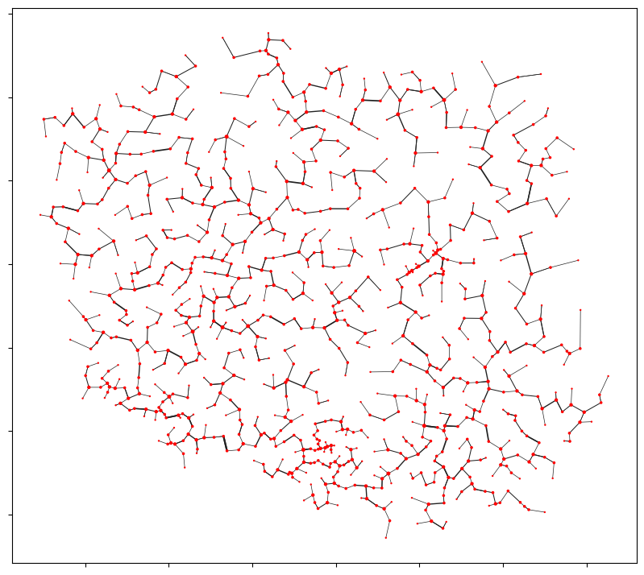
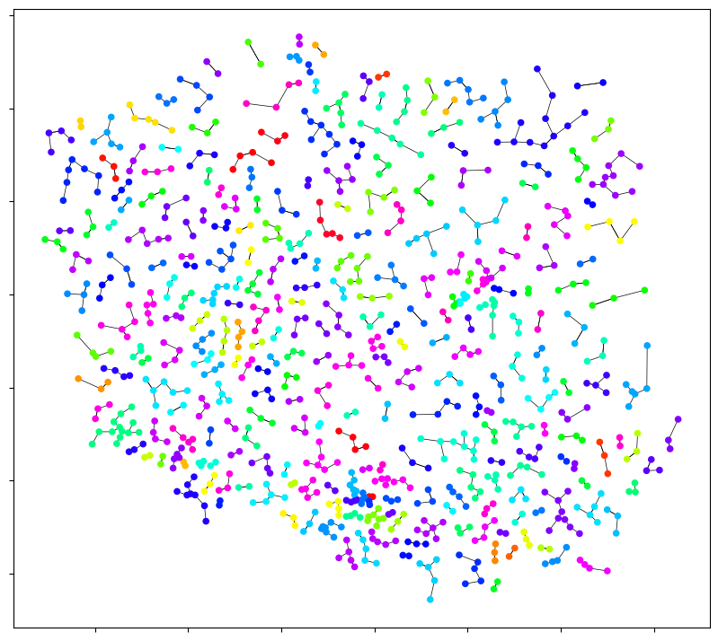
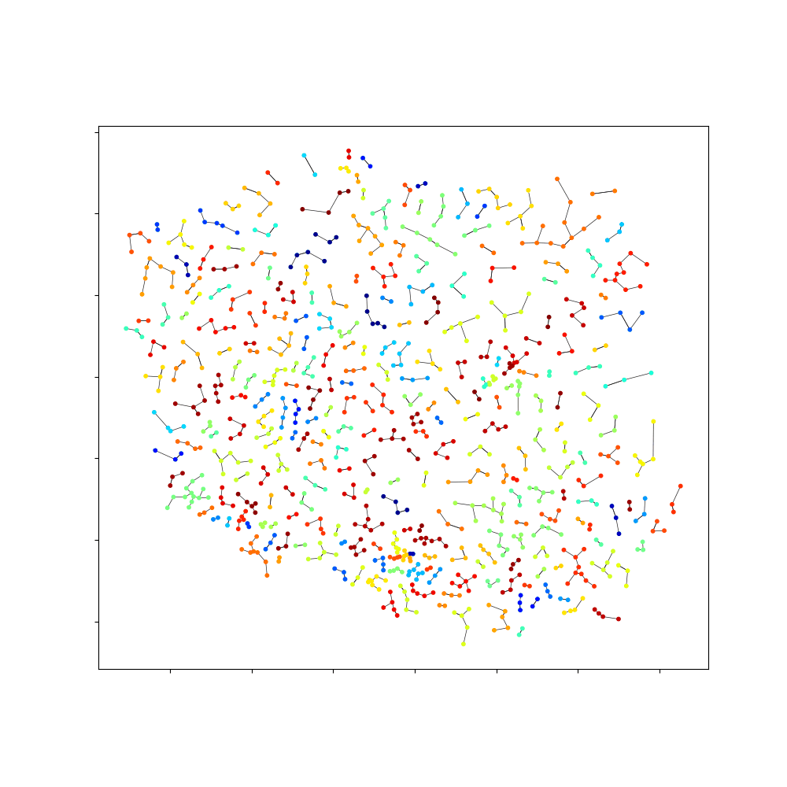

# wroclaw-taxonomy package

## About

This package consists of one class called `Dendrite` which groupes set of points into clusters based on Wroclaw taxonomy method.

## Installation

You can install this package by using below pip install command in terminal:

`pip install git+https://github.com/TomekMatuszek/wroclaw-taxonomy.git`

## Example

Basic workflow:

```python
from wroclaw_taxonomy import Dendrite

dendrite = Dendrite(src='data/citiesPL_pop.geojson')
dendrite.calculate(columns=['lat', 'lon'], normalize=False)

dendrite.export_objects(out_file='dendrite_points.geojson')
dendrite.export_dendrite(out_file='dendrite.geojson')

dendrite.plot()
```



Customizing plot:

```python
dendrite.plot(
    level=1, lines=True,
    style = {
        "markersize": 20,
        "cmap": 'gist_rainbow',
        "line_color": '#000000',
        "object_color": '#0000ff'
    }
)
```



Animation showing every stage of the dendrite creation:

```python
dendrite.animate()
```

